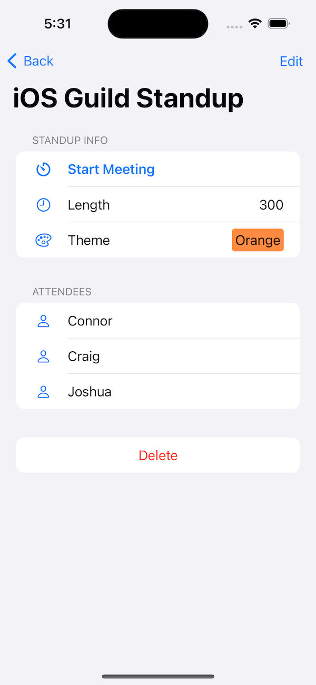
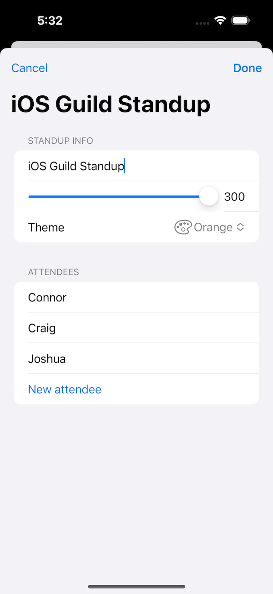
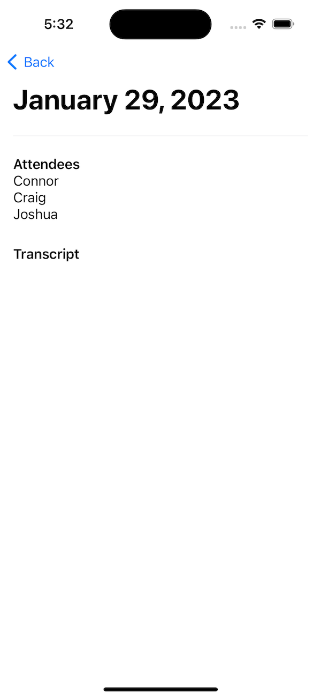
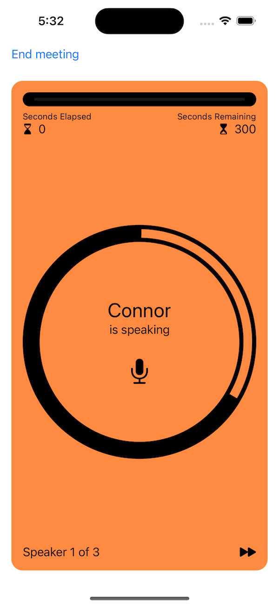

# `Standups.app` Overview
## What is `Standups.app`?
Standups is a small application that allows the user to manage and record their daily standups.

## `StandupsList` Feature
A user can view all of their standups and create new ones. Standups are persisted to disk so that they can be loaded on each launch of the application.

## `StandupDetail` Feature
A user can view all the details of a given standup, such as the meeting's length, theme, attendees, and previous meetings. The user can choose to edit their standup or start and record a new meeting.

## `RecordStandup` Feature
While recording a standup, the user can view how many seconds have elapsed, how many seconds are remaining, and whose turn it is to speak. The user can choose to skip a given speaker or end the meeting early.

## Up next: Managing Logic & Views
In the next section, we will talk about [[managing_logic_and_views|Managing Logic & Views]] and what it means to build a complex and scalable application. 